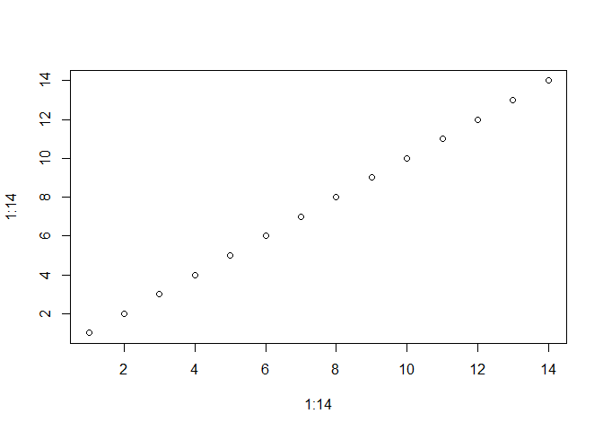

<!-- README.md is generated from README.Rmd. Please edit that file -->

# TSAIB

<!-- badges: start -->
<!-- badges: end -->

The goal of TSAIB is to estimate a model based on time series analysis,
and account for intermission bias of satellite observations. Input file
type: NetCDF (Network Common Data Form).

## Installation

You can install the development version of TSAIB like so:

``` r
# FILL THIS IN! HOW CAN PEOPLE INSTALL YOUR DEV PACKAGE?
```

## Example

This is a basic example which shows you how to solve a common problem:

``` r
library(TSAIB)
## basic example code
TSdiagnostics(TSdata$TSmatrix[2,2,])
#> `stat_bin()` using `bins = 30`. Pick better value with `binwidth`.
```



    #> Number of NaN's in the data set
    #> [1] 0
    #> Number of objects in the data set
    #> [1] 325
    #> Fraction of the data set which is NaN's
    #> [1] 0
    #> mean
    #> [1] -0.005424615
    #> standard deviation
    #> [1] 0.06689967
    #> median
    #> [1] -0.011
    #> quantile
    #>     0%    25%    50%    75%   100% 
    #> -0.215 -0.045 -0.011  0.038  0.176 
    #> sum
    #> [1] -1.763
    #> 
    #>  One Sample t-test
    #> 
    #> data:  TS
    #> t = -1.4618, df = 324, p-value = 0.1448
    #> alternative hypothesis: true mean is not equal to 0
    #> 95 percent confidence interval:
    #>  -0.012725168  0.001875937
    #> sample estimates:
    #>    mean of x 
    #> -0.005424615

What is special about using `README.Rmd` instead of just `README.md`?
You can include R chunks like so:

``` r
summary(cars)
#>      speed           dist       
#>  Min.   : 4.0   Min.   :  2.00  
#>  1st Qu.:12.0   1st Qu.: 26.00  
#>  Median :15.0   Median : 36.00  
#>  Mean   :15.4   Mean   : 42.98  
#>  3rd Qu.:19.0   3rd Qu.: 56.00  
#>  Max.   :25.0   Max.   :120.00
```

You’ll still need to render `README.Rmd` regularly, to keep `README.md`
up-to-date. `devtools::build_readme()` is handy for this. You could also
use GitHub Actions to re-render `README.Rmd` every time you push. An
example workflow can be found here:
<https://github.com/r-lib/actions/tree/v1/examples>.

You can also embed plots, for example:


In that case, don’t forget to commit and push the resulting figure
files, so they display on GitHub and CRAN.
