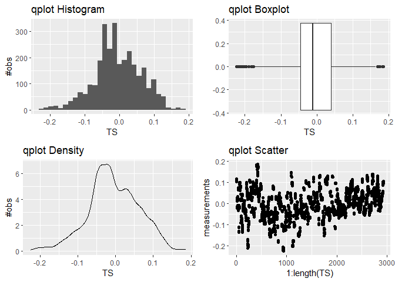

<!-- README.md is generated from README.Rmd. Please edit that file -->

# TSAIB

<!-- badges: start -->
<!-- badges: end -->

The goal of TSAIB is to estimate a model based on time series analysis,
and account for intermission bias of satellite observations. Input file
type: NetCDF (Network Common Data Form).

## Installation

You can install the development version of TSAIB like so:

``` r
# FILL THIS IN! HOW CAN PEOPLE INSTALL YOUR DEV PACKAGE?
```

## Example

This is a basic example which shows you how to solve a common problem:

``` r
library(TSAIB)
## Initially extract the wanted time series data from your NetCDF object (nco) using GridTSExtract:
#?GridTSExtract
# Description
#  Extracts a time series from a NetCDF lon&lat coordinate grid
# Usage
#GridTSExtract(
#  nco,
#  lonid = "longitude",
#  latid = "latitude",
#  timeid = "date",
#  measurementsid = "sea_level_anomaly",
#  coord = c(-165, 74),
#  radius = 0,
#  dlon = 2,
#  dlat = 4
#)
# Arguments
#  nco: The NetCDF object (open with "nc_open" from the "ncdf4" library)
#  lonid: The variable id for longitude vector. e.g.: "longitude"
#  latid: The variable id for latitude vector. e.g.: "latitude"
#  timeid: The variable id for the time vector. e.g.: "date"
#  measurementsid: The variable id for the measurements vector. e.g.: "sea_level_anomaly"
#  coord: The center coordinate for the TS grid area. e.g.: c(lon,lat) i.e. c(-164,74)
#  radius: The square radius of the TS grid. e.g: 0=1x1 grid, 1=3x3 grid, 2=5x5 grid etc.
#  dlon: Number of data points for each degree longitude
#  dlat:Number of data points for each degree latitude

#TSdata=GridTSExtract(nco,"longitude","latitude","date","sea_level_anomaly",c(-165,74),1,2,4)

## See documentation for the data:
#?TSdata
# Description
#  An extracted list using the "GridTSExtract" function, from the data set:
#  Rose, S.K.; Andersen, O.B.; Passaro, M.; Ludwigsen, C.A.; Schwatke, 
#  C. Arctic Ocean Sea Level Record from the Complete Radar 
#  Altimetry Era: 1991�2018. Remote Sens. 2019, 11, 1672. 
#  https://www.mdpi.com/2072-4292/11/14/1672"
# Usage
#  TSdata
# Format
#  A large list containing 5 elements, which are:
#  longitude: containing longitudes from -180:180, by increments of 0.5 degrees (length: 720)
#  latitude: containing latitudes from 65:81.5, by increments of 0.25 degrees (length: 67)
#  date: containing years from 1991:2019, by increments of 1/12 (length:325)
#  measurements: containing sea_level_anomaly measurements for each increments of: 
#  longitude, latitude and date. (dimension: [67,720,325])
#  TSmatrix: containing a 3x3x325 grid of measurements centered around (lon,lat)=(-165,74)

## TSdiagnostics can be used to gather simple statistics about the data
#?TSdiagnostics
# Description
#  Shows basic statistics and characteristics of the time series data
# Usage
#  TSdiagnostics(TS, nanrem = "FALSE")
# Arguments
#  TS:The time series to be analyzed
#  nanrem: Set NaN to be removed or not. e.g.: nanrem="TRUE"

TSdiagnostics(TSdata$TSmatrix,nanrem="TRUE") #analyze extracted dataset, and remove NaN
#> `stat_bin()` using `bins = 30`. Pick better value with `binwidth`.
#> Warning: Removed 4 rows containing non-finite values (stat_bin).
#> Warning: Removed 4 rows containing non-finite values (stat_boxplot).
#> Warning: Removed 4 rows containing non-finite values (stat_density).
#> Warning: Removed 4 rows containing missing values (geom_point).
```



    #> Number of NaN's in the data set
    #> [1] 4
    #> Number of objects in the data set
    #> [1] 2925
    #> Fraction of the data set which is NaN's
    #> [1] 0.001367521
    #> mean
    #> [1] -0.005382746
    #> standard deviation
    #> [1] 0.06690633
    #> median
    #> [1] -0.011
    #> quantile
    #>     0%    25%    50%    75%   100% 
    #> -0.224 -0.046 -0.011  0.040  0.185 
    #> sum
    #> [1] -15.723
    #> 
    #>  One Sample t-test
    #> 
    #> data:  TS
    #> t = -4.3481, df = 2920, p-value = 1.42e-05
    #> alternative hypothesis: true mean is not equal to 0
    #> 95 percent confidence interval:
    #>  -0.007810080 -0.002955411
    #> sample estimates:
    #>    mean of x 
    #> -0.005382746

What is special about using `README.Rmd` instead of just `README.md`?
You can include R chunks like so:

``` r
summary(cars)
#>      speed           dist       
#>  Min.   : 4.0   Min.   :  2.00  
#>  1st Qu.:12.0   1st Qu.: 26.00  
#>  Median :15.0   Median : 36.00  
#>  Mean   :15.4   Mean   : 42.98  
#>  3rd Qu.:19.0   3rd Qu.: 56.00  
#>  Max.   :25.0   Max.   :120.00
```

You’ll still need to render `README.Rmd` regularly, to keep `README.md`
up-to-date. `devtools::build_readme()` is handy for this. You could also
use GitHub Actions to re-render `README.Rmd` every time you push. An
example workflow can be found here:
<https://github.com/r-lib/actions/tree/v1/examples>.

You can also embed plots, for example:


In that case, don’t forget to commit and push the resulting figure
files, so they display on GitHub and CRAN.
